<h1 align="center">
  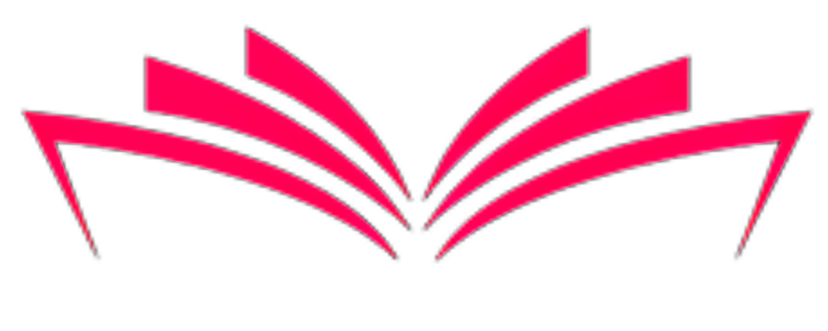
   Lectify
  

      
      
      
  

</h1>

**Lectify** é um site moderno e prático para geração de resumos a partir de URLs do YouTube e criação de testes com base em arquivos PDF ou MD. O projeto tem como objetivo facilitar o acesso rápido à informação e promover uma experiência de aprendizado interativa e acessível.

## 🖼️ Visualização do Projeto

### Versão Desktop

  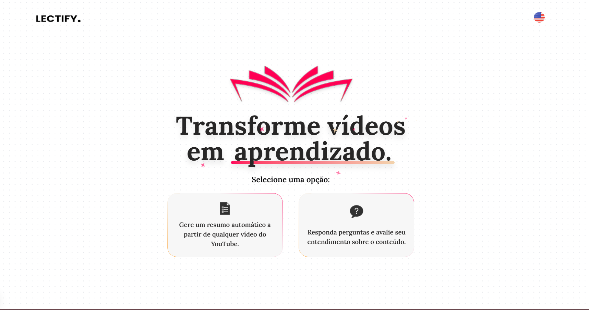 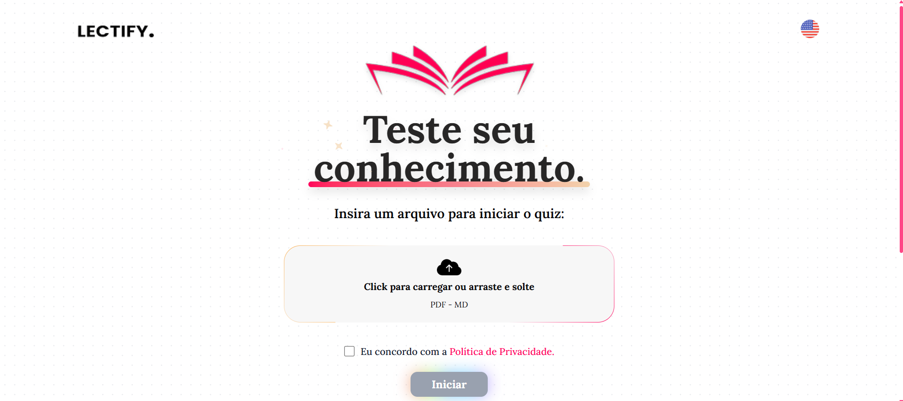
  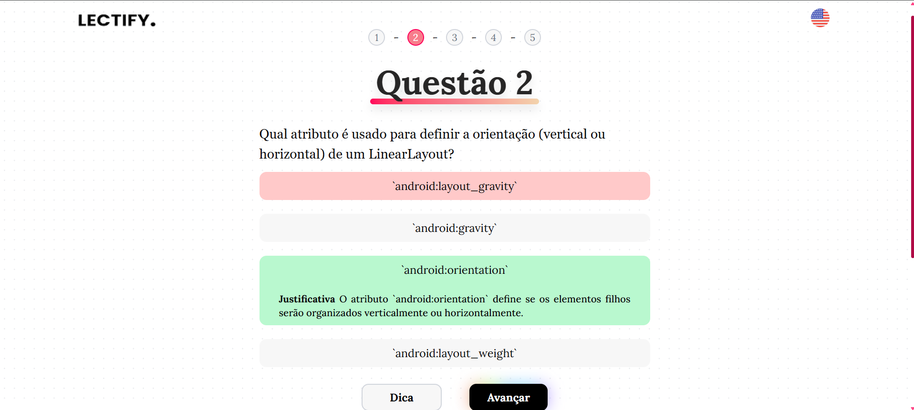 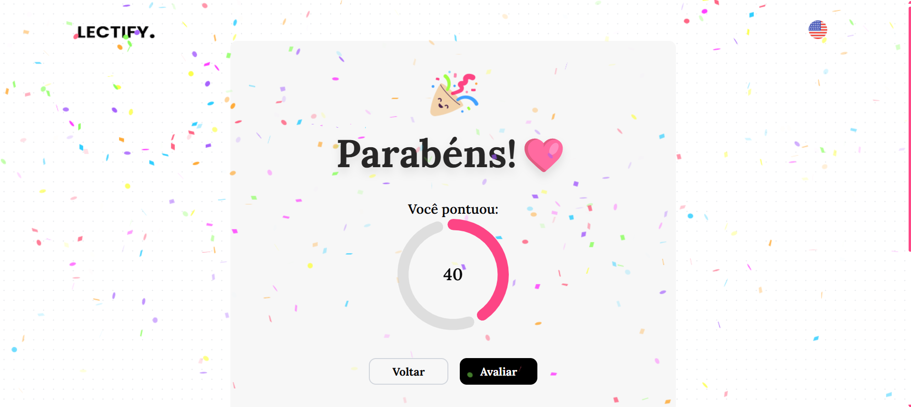
  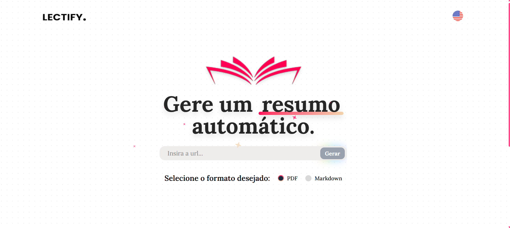 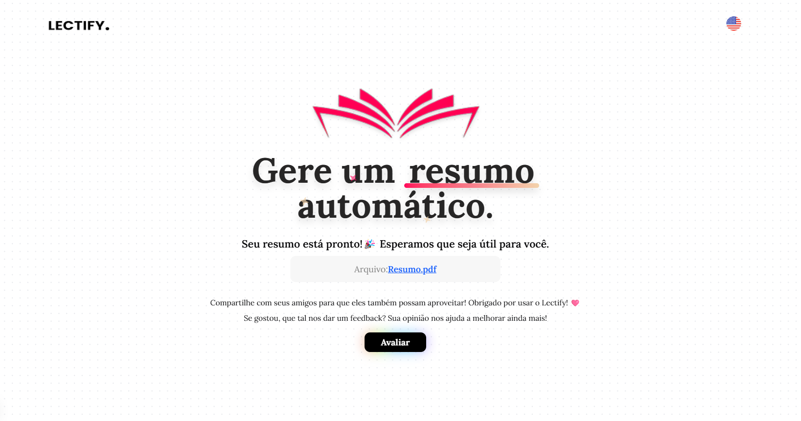

### Versão Mobile

   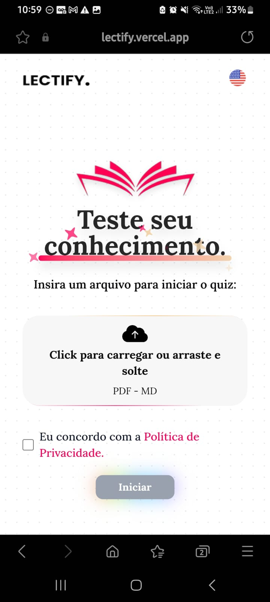 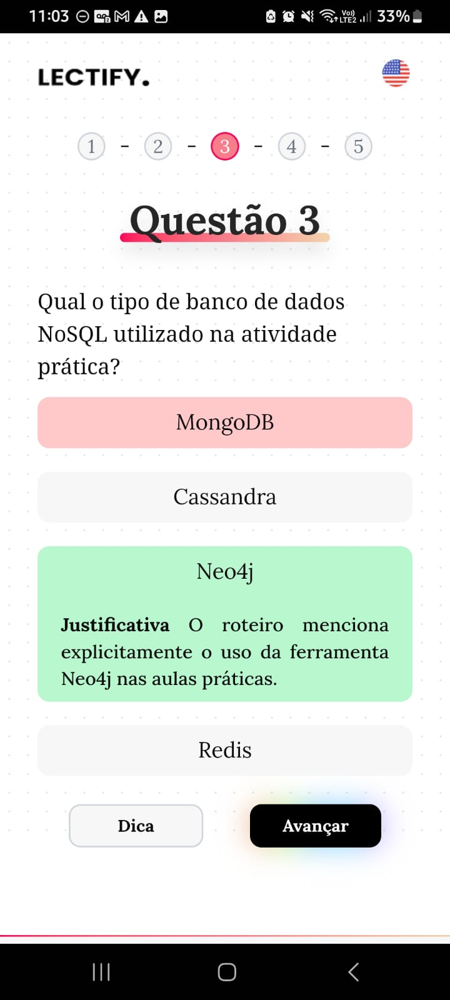
  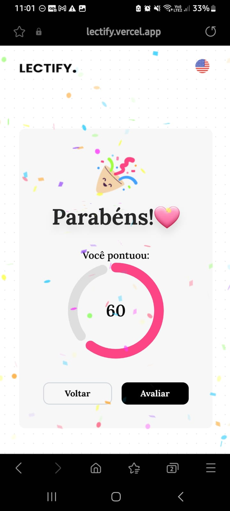 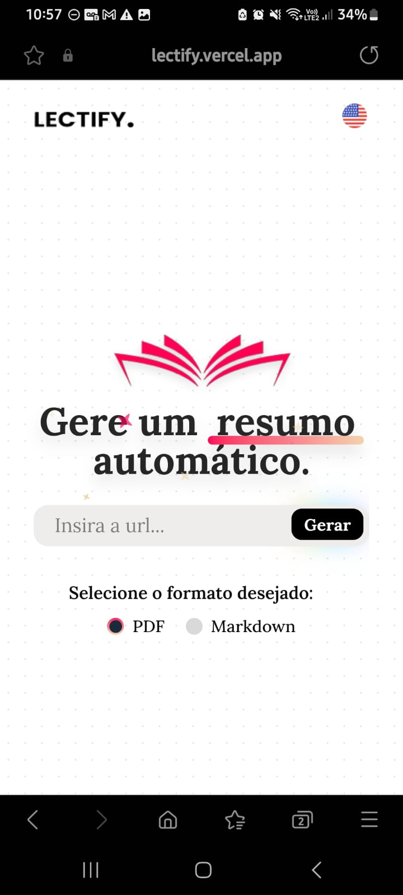 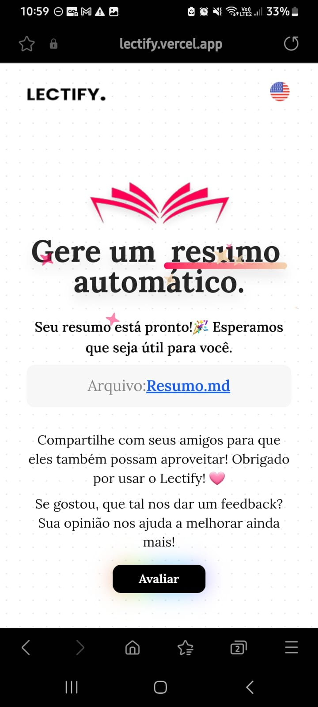

---

## 🎥 Demonstração em Vídeo

Veja o funcionamento do Lectify através do meu [perfil no LinkedIn](https://www.linkedin.com/in/francine-ccruz/)

---

## 🎨 Protótipo 
Confira o protótipo e a publicação do projeto:  
- [Publicação no LinkedIn](https://www.linkedin.com/posts/francine-ccruz_lectify-desenvolvimento-frontend-activity-7303047547168657408-uN-v?utm_source=share&utm_medium=member_desktop&rcm=ACoAADK4YRwBlcPUB4Yk5lyXLHiLZFwjALPCPDw)  
- [Protótipo no Figma](https://www.figma.com/design/iKSdY18LVslAhhKEBFwP2s/Lectify?node-id=0-1&p=f&t=IGYZdzzFBBA5VrYj-0)

---

## 🚀 Tecnologias Utilizadas
-  Biblioteca para criação de interfaces de usuário.
-  Framework React para renderização híbrida e construção de aplicações web escaláveis e performáticas.
-  Framework de CSS utilitário para estilização responsiva e customizável.
-  Superset do JavaScript que adiciona tipagem estática, promovendo segurança e manutenção do código.
-  Ferramenta para criar animações fluidas e responsivas, melhorando a experiência do usuário.
-  Biblioteca para implementação de animações elegantes e interativas na interface.
-  Serviço que permite o envio de emails diretamente do frontend sem a necessidade de um backend dedicado.
-  Biblioteca para realizar requisições HTTP, facilitando a comunicação com APIs.
-  Solução para internacionalização, permitindo suporte a múltiplos idiomas de forma simples e eficiente.

---

## 🔄 Funcionalidades Principais

- **Geração de Resumos**: Criação de resumos em PDF ou MD a partir de URLs do YouTube.  
  *Observação:* O idioma do resumo é definido conforme o idioma do site (Lectify).
  
- **Geração de Testes**: Arraste e solte arquivos (MD ou PDF) e, após a concordância com as Políticas de Privacidade, gere um teste rápido com 5 questões baseadas no conteúdo do arquivo.  
  *Observação:* O idioma do teste é definido com base no arquivo inserido.
  
- **Interface Responsiva**: Design adaptado para oferecer uma ótima experiência tanto em desktop quanto em dispositivos móveis.
  
- **Suporte Multilíngue**: Alternância entre inglês e português (en/pt-br).
  
- **Feedback Visual**: Indicadores de carregamento e feedbacks visuais que melhoram a experiência do usuário durante os serviços e interações.

---

## 🔙 Backend
O backend foi desenvolvido por [George Victor](https://github.com/id0ubl3g) e é responsável pelo processamento na geração dos resumos e testes.  

Confira a documentação completa da API [aqui](https://github.com/id0ubl3g/lectify-flask-api).

---

## 🔧 Em desenvolvimento:

Estamos constantemente aprimorando o Lectify! Confira as próximas funcionalidades que estão em desenvolvimento:

> **Tema escuro/claro:**  
> Em breve, os usuários poderão alternar entre tema claro e escuro para uma experiência de visualização personalizada.

---

## 🤝 Colaboração

Este projeto foi desenvolvido com o suporte de [George Victor](https://github.com/id0ubl3g/lectify-flask-api) para o backend, que gerencia a geração do resumo/teste. A divisão de responsabilidades foi:

- **Frontend**: Responsável pela criação da interface e experiência do usuário.
- **Backend**: API para o processamento da geração do resumo/teste e a lógica por traz.

---

## 🌐 Redes Sociais

Conecte-se conosco nas redes sociais:

- **LinkedIn**: [Francine Cruz](https://www.linkedin.com/in/francine-ccruz/)
- **LinkedIn**: [George Victor](https://www.linkedin.com/in/id0ubl3g/)
- **GitHub**: [George Victor](https://github.com/id0ubl3g)

---

## 📝 Licença

Este projeto está licenciado sob a **Apache 2.0**. Consulte o arquivo [LICENSE](LICENSE) para mais detalhes.
